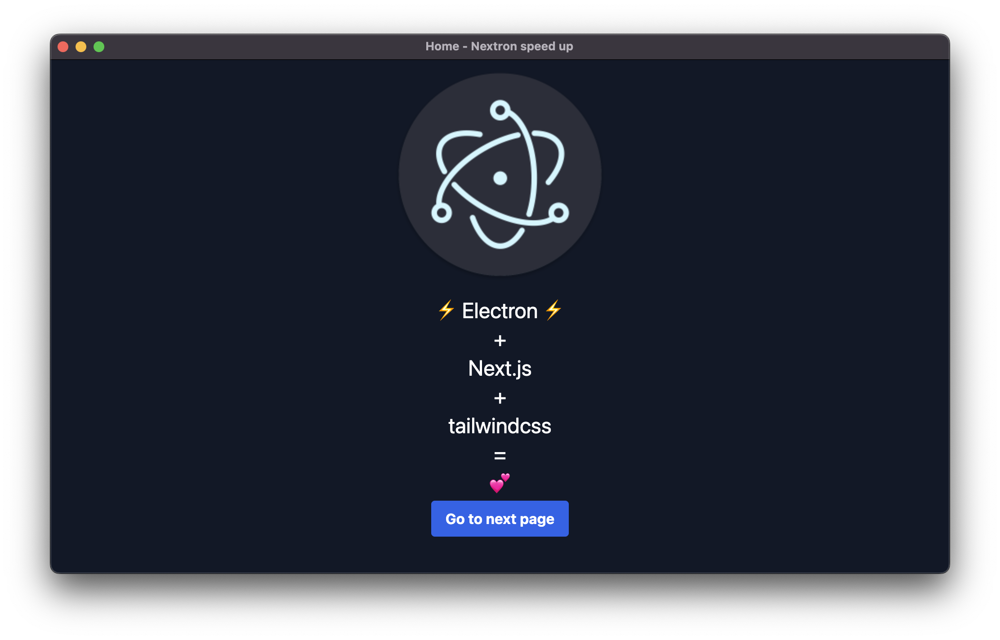

<p align="center"></p>

## Usage

### Clone the repo

```bash
# clone the main branch
git clone https://github.com/bm777/nextron-speed-launch.git

```

### Install Dependencies

```bash
cd nextron-speed-launch

# using yarn or npm
npm install
```

### Use it

```bash
# development mode
npm run dev

# production build (see the command in the package.json to run for your specific arch)
npm run build
```
